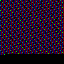

# Text to image coder
Encoding and decoding bytes from images with features.

Program has:
- Separated CLI mode and library
- Convert text to image with just red colors
- Image colorize mode, to make image looks like LED display
- Image blackize mode, to make image darker and more hidden

## Example images

Just red colors

Colorized mode

Blackized mode

## Usage
### Writing bytes to image
You can load bytes from text file *(encoding is depends by file)*, or you can leave file path empty and specify your text *(you specifying encoding)*.

After that leave output image filename, and image width and height.

After that you can leave byte colorize mode:
- Simple red data — don't colorize,
- Colorize bytes — to make it looks like LED display,
- Blackize bytes — to make it darker and more hidden.

### Reading text (or bytes) from image
You can read text or bytes from image, specify image filename and encoding. For UTF-8 encoding you can leave input empty, for raw bytes leave "n". After that you will be get decoded text. If decoding has errors or warnings, it will be displayed.
